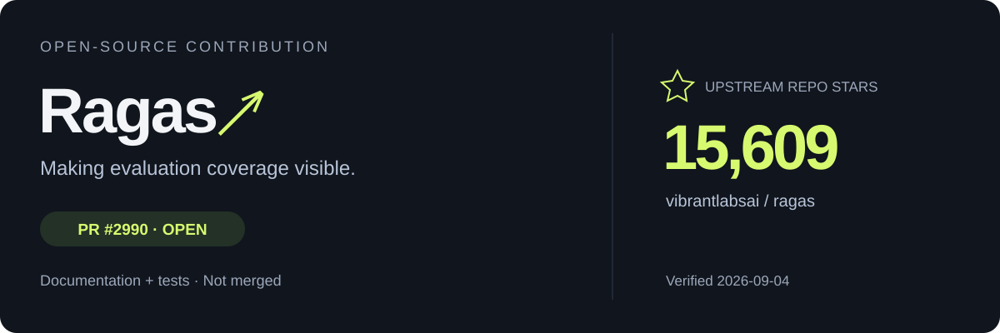

  

  
  
  

# Hey, I'm metro.

把想法做成能用的工具，也认真打磨它们的样子。

I explore the space between **AI workflows, product thinking, and visual craft** — with projects you can actually open and inspect.

[Explore my projects](https://github.com/chongchonghaoman?tab=repositories) · [Start with ViralX](https://github.com/chongchonghaoman/ViralX)

---

## Selected work · 精选作品

### [ViralX ↗](https://github.com/chongchonghaoman/ViralX)

查看 ViralX 真实界面

**★ 7 Stars** · 仓库 Star 快照 · 2026-09-04

**把爆款拆到每一秒，也把每个结论还给证据。**

短视频证据工作台。从视频发现、原片采集到带时间引用的分析与复刻脚本，把「模型说了什么」和「原片里有什么」放在一起检查。

`Video evidence` · `AI workflows` · `Web + Agent Skill`

<b>项目详情 · 从视频发现到证据报告</b>

- **面向谁：** 需要研究短视频案例的内容创作者与电商运营。
- **解决什么：** 将候选视频、原片、分析结论与时间引用连接起来，便于回看核验。
- **产品形式：** Web 工作台与 Agent-native Skill 两种入口。
- **关注的体验：** 出错后保留证据与检查点，区分失败、缺失和可恢复状态。
- **能力边界：** 不把分析报告当作流量保证；实现、运行条件与验证记录以仓库为准。

[查看项目与使用说明 ↗](https://github.com/chongchonghaoman/ViralX)

### [vibe-web-auditor ↗](https://github.com/chongchonghaoman/vibe-web-auditor)

**做出来之后，还要看它是不是真的好用。**

面向 vibe-coded 网站的审查 Skill：结合真实浏览器证据，检查界面、文案、页面逻辑与模板感。

`Browser evidence` · `UX review` · `Agent Skill`

<b>项目详情 · 网站上线之前的审查视角</b>

围绕真实浏览器中的界面、文案和页面逻辑查找问题，同时检查设计是否过度模板化。项目入口与具体审查方法见仓库。

[查看审查 Skill ↗](https://github.com/chongchonghaoman/vibe-web-auditor)

### [design-auto-orchestrator-kit ↗](https://github.com/chongchonghaoman/design-auto-orchestrator-kit)

**让设计需求找到合适的工具。**

Codex 设计类 Skill 自动编排与安装套件，把零散的设计能力组织成可调用的工作流。

`Design tooling` · `Skill routing` · `Codex`

<b>项目详情 · 从设计需求到 Skill 路由</b>

将设计任务分类、Skill 选择与安装组织成一套 Codex 工具链，帮助设计需求找到合适的下游能力。具体支持范围与安装方法见仓库。

[查看设计编排套件 ↗](https://github.com/chongchonghaoman/design-auto-orchestrator-kit)

## Open-source contributions · 开源贡献

### [Ragas ↗](https://github.com/vibrantlabsai/ragas)

**评估分数之外，也要看见多少样本真正参与了评估。**

向 Ragas 提交评估结果说明与测试补充：解释缺失分数（`NaN`）如何影响均值，提供按指标查看有效样本数与覆盖率的示例，并补充零分、部分缺失、全部缺失及不同指标分母的测试用例。

[PR #2990 · docs: explain evaluation means with missing scores](https://github.com/vibrantlabsai/ragas/pull/2990)

`LLM evaluation` · `Documentation` · `Tests`

状态：已提交，尚未合并 · 核验于 2026-09-04；最新进展见 PR。

<b>贡献详情 · 为什么均值之外还需要覆盖率？</b>

例如，三个样本得分为 `[0.8, NaN, NaN]` 时，显示的均值可能仍是 `0.8`，但它只代表一个有效样本。

这条 PR 补充文档与测试，让读者能通过 `result.scores` 同时查看均值、有效样本数、总样本数和覆盖率；**不修改聚合逻辑或结果 API**。

- 文档：`docs/references/evaluate.md`
- 测试：`tests/unit/test_dataset_schema.py`
- 测试情形：有效零分、部分缺失、全部缺失，以及不同指标使用不同分母。

[查看 PR 与审查进展 ↗](https://github.com/vibrantlabsai/ragas/pull/2990)

## Side projects · 实验与小工具

有些工具，起点只是一个「这件事能不能顺手一点」。

- **[ValorantStretch](https://github.com/chongchonghaoman/ValorantStretch)** — VALORANT 4:3 真拉伸 Windows 工具，包含自动桥接、目标拉伸与退出恢复。
- **[DesignMirror](https://github.com/chongchonghaoman/DesignMirror)** — 从网页 URL 提取设计 token 的 AI 辅助分析工具。

<b>A few things I care about</b>

 

- **先弄清问题。** 工具多，不等于问题被解决。
- **保留证据。** 把观察、推断和未验证的部分分开。
- **完成最后一公里。** 关注失败提示、恢复路径和实际使用体验。
- **和 AI 协作，也保留判断。** 用 Codex 等工具辅助实现；代码与具体贡献以各仓库记录为准。

---

  <b>Different lines. Same curiosity.</b> 
  metro loe · <a href="https://github.com/chongchonghaoman">@chongchonghaoman</a>

[↑ 返回顶部](#top) · [浏览全部仓库 ↗](https://github.com/chongchonghaoman?tab=repositories)
